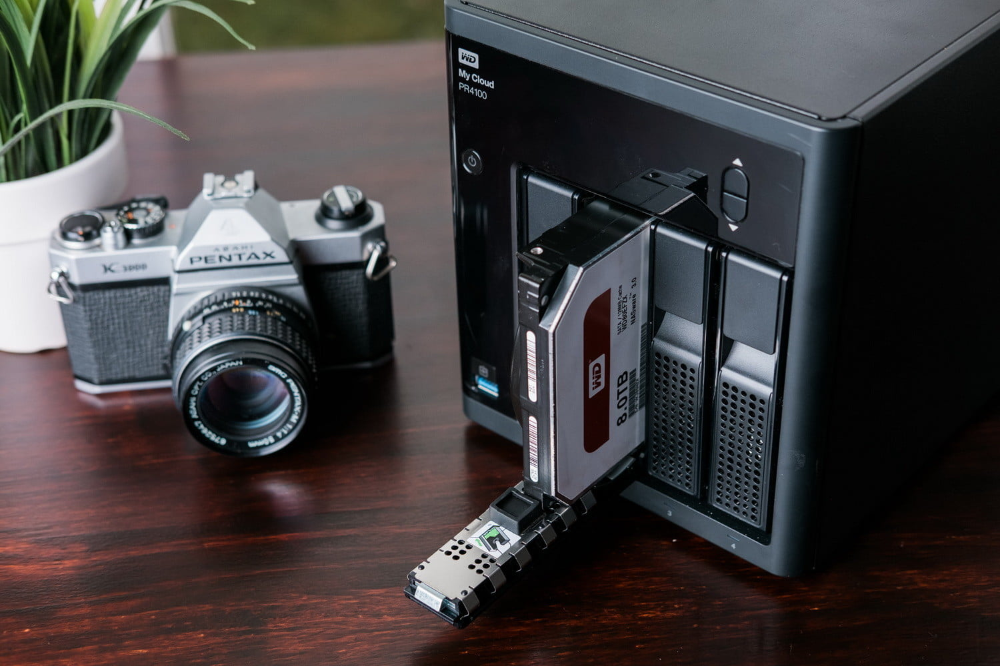

# Setting up Ubuntu Server on WD PRx100

_Disclaimer: do this at your own risk. No fancy web gui here, just raw unix power._

[](https://shop.westerndigital.com/products/network-attached-storage/wd-my-cloud-pro-series-pr4100)

---

## Overview

[Original](https://community.wd.com/t/guide-how-to-install-ubuntu-18-04-server-on-the-my-cloud-pr4100-nas/232786) article was not covering all topics important for me so I had to do some reverse engineering and add some tweaks.

This tutorial covers how to install Ubuntu Server on WD PR4100 or PR2100.

It goes from preparation, downloading required packages, running installation, initial configuration and extras that most likely are intended to be used.

The whole process can be accomplished on any linux-like system equipped with `KVM`.

**HOWEVER** if Your are looking for something more extendable, serverish, and installable with classical way.. give a try [older brother - HPE ProLiant MicroServer GEN10](https://github.com/aamkye/ubuntu_on_HPE_ProLiant_MS_GEN10).

---

## Ansible (automated way)

There is [ansible](./ansible) folder with automatization of all steps from [extras](#extras-meant-to-be-run-on-nas-directly) and more.

---

## PR4100 Spec

```
* Release date: 2016
* CPU: Intel Pentium N3710 quad-core @ 1.6 GHz
* RAM: 4 GB DDR3
* USB: 3 x 3.0 ports
* Bays: 4 x 3.5" SATA III
* LAN: 2 x 1 Gbit/s Ethernet
```

---

## Links:

* <https://community.wd.com/t/guide-how-to-install-ubuntu-18-04-server-on-the-my-cloud-pr4100-nas/232786>
* <https://packages.debian.org/bullseye/all/ovmf/download>
* <https://netplan.io>
* <https://github.com/michaelroland>
* <https://community.wd.com/u/dswv42>
* <https://github.com/WDCommunity/wdnas-hwtools>
* <https://wiki.archlinux.org/title/ZFS/Virtual_disks>
* <https://linuxhint.com/zfs-concepts-and-tutorial>
* <https://ubuntu.com/tutorials/setup-zfs-storage-pool#1-overview>
* <https://arstechnica.com/gadgets/2021/06/a-quick-start-guide-to-openzfs-native-encryption/>
* <https://www.theurbanpenguin.com/creating-zfs-data-sets-and-compression/>

---

## Supported devices

* **WD PR2100**
* **WD PR4100**

**WD DL2100** and **WD DL4100** are not supported because of ARM architecture.

---

## Requirements

* ~13G free space
* `KVM`/`QEMU`
* USB flash drive (8GB+)
* `brew` (macos only)
* `pv`
* `python`

---

## Preparation (manual way)

### Common

```bash
#Prepare a working directory
mkdir ubuntu && cd ubuntu
```

### Ubuntu

```bash
sudo apt install qemu-kvm ovmf

#Copy the UEFI bootloader to a local file named bios.bin
cp /usr/share/ovmf/OVMF.fd bios.bin
```

### MacOS (native M1 not supported)

```bash
brew install qemu
brew install gtk+

# Get the OVMF debian package 6
# https://packages.debian.org/bullseye/all/ovmf/download
curl http://ftp.us.debian.org/debian/pool/main/e/edk2/ovmf_2020.11-2_all.deb -o ovmf_2020.11-2_all.deb

# Unpack and get the UEFI bios file.
ar -x ovmf*.deb
tar -xf data.tar.xz
mv usr/share/OVMF/OVMF.fd bios.bin

# compatibility alias
alias kvm="qemu-system-x86_64"
```

---

## Download the Ubuntu Server

Download chosen iso from [here](https://ubuntu.com/download/server).

---

## Main process

Find out the name of your USB flash drive with `lsblk`.

**I'll use `/dev/sdX` here.**

Boot the iso installer:

```bash
sudo kvm -bios ./bios.bin -L . -cdrom <path_to_iso> -drive format=raw,file=/dev/sdX -boot once=d -m 1G
```

It should boot with a black grub screen to install Ubuntu.

Complete the installation with the defaults and any extra package that you may be interested in (e.g. Nextcloud).

Note down the user and password, you need it to login into the machine later.

At the end, it will reboot and ask you to remove the cdrom.

Just close the whole window to shutdown the whole virtual machine.

Then boot without cdrom straight from the USB flash drive.

Login in the virtual machine and update packages if you like:

```bash
sudo kvm -bios ./bios.bin -L . -drive format=raw,file=/dev/sdX -m 1G
```

---

## Post installation (while `kvm` is still running)

### Networking dynamic

Ubuntu is now installed for a virtual network interface with the new `udev` persistent networking naming.

```bash
ip addr show
```

You'll see the current network interface is called `ens3` or similar.

This won't work on actual My Cloud hardware.

Create the netplan configuration with dhcp support:

```bash
sudo <editor> /etc/netplan/01-netconfg.yaml
```

```yaml
network:
  version: 2
  renderer: networkd
  ethernets:
    eno1:
      match:
        macaddress: <mac1>
      dhcp4: yes
      set-name: eno1
    eno2:
      match:
        macaddress: <mac2>
      dhcp4: yes
      set-name: eno2
```

_MACADDRESSES could be found on device or on the box, however there is hackish way in [EXTRAS](#hackish-way-to-obtain-macaddresses) at the very end_

This causes the NAS to get a dynamic IPv4 address on both of its onboard `eno` interfaces.

However, here's how to combine the throughput of the 2 network interfaces on a single IP address.

```yaml
network:
  version: 2
  renderer: networkd
  ethernets:
    eno1:
      match:
        macaddress: <mac1>
      dhcp4: no
      set-name: eno1
    eno2:
      match:
        macaddress: <mac2>
      dhcp4: no
      set-name: eno2
  bonds:
    bond0:
      interfaces: [eno1, eno2]
      dhcp4: yes
      parameters:
        mode: 802.3ad
        mii-monitor-interval: 1
```

Static IP config should be easy too.

_More info (static IP, bonding, etc) on <https://netplan.io>._

The Ubuntu boot disk is now ready.

Shutdown with:

```bash
sudo halt -p
```

Plug the USB drive in the NAS.

**Boot up and enjoy!**

---

## Extras (meant to be run on NAS directly)

Now you can SSH to your NAS and start installing extras.

### Hardware Control

Thanks to the research of [Michael Roland](https://github.com/michaelroland) and [@dswv42](https://community.wd.com/u/dswv42) we now have full control over the fan, lcd, buttons and sensors.

Ubuntu ships with the `8250_lpss` module, so you don't need to build a custom kernel.

The PMC is accessible at serial port `/dev/ttyS5`.

You need some packages from the `universe` repo.

```bash
sudo add-apt-repository universe
cd /opt
git clone https://github.com/WDCommunity/wdnas-hwtools
cd /opt/wdnas-hwtools
sudo ./install.sh
```

---

### Create a new ZFS array

[Here's](https://wiki.archlinux.org/title/ZFS/Virtual_disks) a great overview on the core features of ZFS, also [this](https://linuxhint.com/zfs-concepts-and-tutorial/) might help.

Now let's create a `ZFS` array on the `PRx100`.

Insert your disks (hotplug is allowed).

List them:

```bash
$ lsblk -d
NAME         MAJ:MIN RM  SIZE RO TYPE MOUNTPOINT
...
sda            8:0    0  1.8T  0 disk
sdb            8:16   0  1.8T  0 disk
sdc            8:32   0  1.8T  0 disk
sdd            8:48   0  1.8T  0 disk
...
```

If you are migrating from old CloudOS and RAID was setup, you need to do following (wipeout raid info and format disks):

**WARNING THIS STEP IS IRREVERSIBLE, PROCEED AT YOUR OWN RISK**

```bash
# For each disk
sudo wipefs --all --force /dev/sd[a-d]

# For each disk (plus following commands)
sudo fdisc /dev/sd[a-d]

# This step is optional
sudo reboot
```

Create a mirror pool over `/dev/sda` and `/dev/sdb` based on the [Ubuntu Tutorial](https://ubuntu.com/tutorials/setup-zfs-storage-pool#1-overview).

```bash
sudo zpool create media mirror /dev/sda /dev/sdb
```

Alternatively, create a `raidz` pool over 4 disks.

This is similar to a `RAID5` pool, using 1 disk for parity.

```bash
sudo zpool create media raidz /dev/sda /dev/sdb /dev/sdc /dev/sdd
```

Or alternatively, create a `raidz2` pool over 4 disks.

This is similar to a `RAID6` pool, using 2 disk for parity.

```bash
sudo zpool create media raidz2 /dev/sda /dev/sdb /dev/sdc /dev/sdd
```

In order to use it, you need to create a file system (also called dataset) on the `zpool`.

This is similar to a 'share' in the CloudOS.

Here's an example

```bash
# The file system gets mounted automatically at /media/pictures.
sudo zfs create media/pictures
```

or if you used my FreeNAS image to create a `ZFS` array

```bash
sudo zpool import
```

Follow the instructions.

### ZFS native encryption

Additionally you can setup encryption on dataset.

```bash
sudo zfs create -o encryption=aes-256-gcm -o keylocation=prompt -o keyformat=passphrase media/pictures
```

After reboot:

```bash
sudo zfs mount -a
```

More info [here](https://arstechnica.com/gadgets/2021/06/a-quick-start-guide-to-openzfs-native-encryption/>).

---

### Disable internal flash memory

If the internal flash memory is completely broken, you may be unable to restore the original CloudOS.

Installing Ubuntu is a solution, but you'll see system freezes when polling the disks in the `dmesg` output.

A solution is to blacklist the `mmc_block` driver.

```bash
sudo <editor> /etc/modprobe.d/blacklist.conf
```

Add a line with:

```bash
blacklist mmc_block
```

Then:

```bash
sudo update-initramfs -u
```

---

## Hackish way to obtain MACADDRESSES

* run Ubuntu Server from USB drive on NAS without `netplan` config
* wait ~5min since boot
* unplug USB drive from NAS; plug USB drive into PC/MAC
* run Ubuntu Server locally:
  * `sudo kvm -bios ./bios.bin -L . -drive format=raw,file=/dev/sdX -m 1G`
* run `journalctl | grep "ci-info" | less`:

```bash
<date> <hostname> cloud-init[1279]: ci-info: +++++++++++++++++++++++++++Net device info++++++++++++++++++++++++++++
<date> <hostname> cloud-init[1279]: ci-info: +--------+-------+-----------+-----------+-------+-------------------+
<date> <hostname> cloud-init[1279]: ci-info: | Device |   Up  |  Address  |    Mask   | Scope |     Hw-Address    |
<date> <hostname> cloud-init[1279]: ci-info: +--------+-------+-----------+-----------+-------+-------------------+
<date> <hostname> cloud-init[1279]: ci-info: |  eno1  | False |     .     |     .     |   .   | 00:01:02:03:04:05 |
<date> <hostname> cloud-init[1279]: ci-info: |  eth1  | False |     .     |     .     |   .   | 06:07:08:09:10:11 |
<date> <hostname> cloud-init[1279]: ci-info: |   lo   |  True | 127.0.0.1 | 255.0.0.0 |  host |         .         |
<date> <hostname> cloud-init[1279]: ci-info: |   lo   |  True |  ::1/128  |     .     |  host |         .         |
<date> <hostname> cloud-init[1279]: ci-info: +--------+-------+-----------+-----------+-------+-------------------+
<date> <hostname> cloud-init[1279]: ci-info: +++++++++++++++++++Route IPv6 info+++++++++++++++++++
<date> <hostname> cloud-init[1279]: ci-info: +-------+-------------+---------+-----------+-------+
<date> <hostname> cloud-init[1279]: ci-info: | Route | Destination | Gateway | Interface | Flags |
<date> <hostname> cloud-init[1279]: ci-info: +-------+-------------+---------+-----------+-------+
<date> <hostname> cloud-init[1279]: ci-info: +-------+-------------+---------+-----------+-------+
```

* there might be a few more blocks like that, but `Hw-Address` contains values that we are looking for

For some reason default config renames `eno2` to `eth1` and tries to do the same with `eno1`, however our netplan config fixes that issue.

# Ansible

## Pre-requirements

Browse `vars/` folder and do necessary changes like:
  * `packer`:
    * `macaddress`
    * `authorized_keys`
    * `hostname`
    * `username`
    * `password`
  * `zfs`:
    * `zfs_pools`
    * `zfs_datasets`
    * `zfs_dataset_pass`

as well as:
  * `ansible.cfg`:
    * `remote_user`

## Image building

```bash
ansible-playbook packer.yml --ask-become-pass
```

then wait 30-40min and image should create itself via packer in `ansible/tmp/output`

## Image burn

To burn image to `/dev/disk5` (`disk5` used as example), type:

```bash
cd tmp/output

sudo su

#as sudo
pv -tpreb nas-ubuntu-server.img | dd of=/dev/disk5 bs=4096 conv=notrunc,noerror
```

## NAS Part

Unplug USB from PC and plug into NAS (no matter which USB port).

Now You need to localize NAS IP, run the same `nmap`:

_NAS `bond0` interface should have `00:00:00:00:00:01` macaddress._

```bash
nmap -p 22 10.0.0.0/24

(...)
Nmap scan report for 10.0.0.101
Host is up (0.012s latency).

PORT   STATE SERVICE
22/tcp open  ssh
MAC Address: 00:00:00:00:00:01 (Xerox)
(...)
```

If You can ssh to NAS - go to Ansible part.

If not - debug time.

## Ansible part

Just run:

```bash
ansible-playbook all_in_one.yml --ask-become-pass -e "target=10.0.0.101" -i 10.0.0.101,
```

And watch the magic.

After its done, it is done :)

## Helpful stuff

### Aliases

```bash
# Alias for loading password and mounting
function zload() {
  sudo zfs load-key -L prompt $1 && sudo zfs mount $1
}

# Alias for unloading password and unmounting
function zunload() {
  sudo zfs unmount -f $1 && sudo zfs unload-key $1
}

# Wipes whole zfs datasets and pools
zfs destroy -r nas
```

### Manually converting qcow2 to img

```bash
qemu-img convert nas-ubuntu-server.qcow2 -O raw nas-ubuntu-server.img
```

### Existing ZFS pool

It may happen that You already have old ZFS pool:

```bash
TASK [zfs : Create ZFS pool] ***************************************************
fatal: [0.0.0.0]: FAILED! => changed=true
  cmd: zpool create -o autoexpand=on -o autoreplace=on -o delegation=on -o dedupditto=1.5 -o failmode=continue -o listsnaps=on nas raidz2 /dev/sda /dev/sdb /dev/sdc /dev/sdd
  msg: non-zero return code
  rc: 1
  stderr: |-
    invalid vdev specification
    use '-f' to override the following errors:
    /dev/sda1 is part of potentially active pool 'nas'
    /dev/sdb1 is part of potentially active pool 'nas'
    /dev/sdc1 is part of potentially active pool 'nas'
    /dev/sdd1 is part of potentially active pool 'nas'
  stderr_lines: <omitted>
  stdout: ''
  stdout_lines: <omitted>
```

In that situation just type:

```bash
$ sudo zpool import
   pool: nas
     id: 0000000000000000000
  state: ONLINE
status: The pool was last accessed by another system.
 action: The pool can be imported using its name or numeric identifier and
        the '-f' flag.
   see: https://openzfs.github.io/openzfs-docs/msg/ZFS-8000-EY
 config:

        nas         ONLINE
          raidz2-0  ONLINE
            sda     ONLINE
            sdb     ONLINE
            sdc     ONLINE
            sdd     ONLINE
$ sudo zpool import -f 0000000000000000000
$ zload nas/data
```

### Changing password for zfs dataset

_Existing keys has to be loaded._

```bash
zfs change-key \
  -o keylocation=prompt \
  -o keyformat=passphrase \
  nas/data
```

### Changing LVM size

```
* parted /dev/sde
* print (fix if needed)
* resizepart 3
* <input size>
* quit
* pvresize /dev/sde3
* lvextend -r -l100%free /dev/mapper/ubuntu--vg-ubuntu--lv
```

### Debug

While You cannot connect to NAS, unplug USB from it, and plug back to PC. Go to tmp folder (BIOS is there), and run command (replace `disk5` with whatever suits your case):

```bash
sudo kvm -bios ./bios.bin -L . -drive format=raw,file=/dev/disk5 -m 4G
```

Log into system, and dive into logs.

And that's it.
